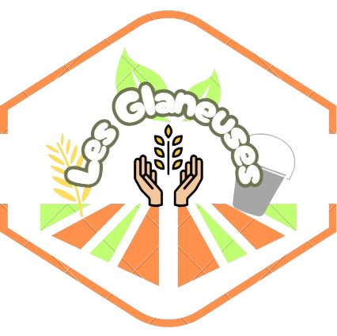

# Les Glaneuses

Ce repo contient le site web des Glaneuses, projet réalisé durant le Hackathon du Crédit Agricole Centre Loire du 11 et 12 avril 2024.
Ce projet a été réalisé en 48h par une équipe de 5 personnes, sans préparation préalable, soyez indulgents.

## Présentation du projet

Le projet des Glaneuses est un site web mettant en relation des agriculteurs et des particuliers. Les premiers peuvent déclarer une période durant laquelle ils autorisent le glanage sur leur terrain, et les seconds peuvent s'inscrire pour venir glaner les fruits et légumes non récoltés.

Chacun y tire un bénéfice : Les agriculteurs évitent le gaspillage alimentaire et touche une rémunération pour les fruits et légumes récoltés, et les particuliers peuvent profiter de fruits et légumes frais et locaux à moindre coût.

## Fonctionnalités

- Inscription des agriculteurs
- Inscription des glaneurs
- Déclaration des périodes de glanage
- Inscription des glaneurs à une période de glanage
- Promotion des autres produits de l'agriculteur (fromages, viandes, etc.)
- Paiement en ligne
- Gestion des avis

## Technologies utilisées

- HTML/CSS
- JavaScript

## Installation

1. Cloner le repo
2. Ouvrir le fichier `src/index.html` dans un navigateur web

## Auteurs

@laurentbouquin
@leo-chartier
@AlexisLasselin
@Evan-UHRING
@MichelRiff

## Mentions spéciales et remerciements

Merci à tous les participants du Hackathon du Crédit Agricole Centre Loire pour leur implication et leur bonne humeur.
Merci à nos mentors pour leur aide précieuse.
Merci à ALGOSUP pour l'oppotunité offerte.
Merci à mes camarades pour leur travail acharné et leur bonne humeur.
